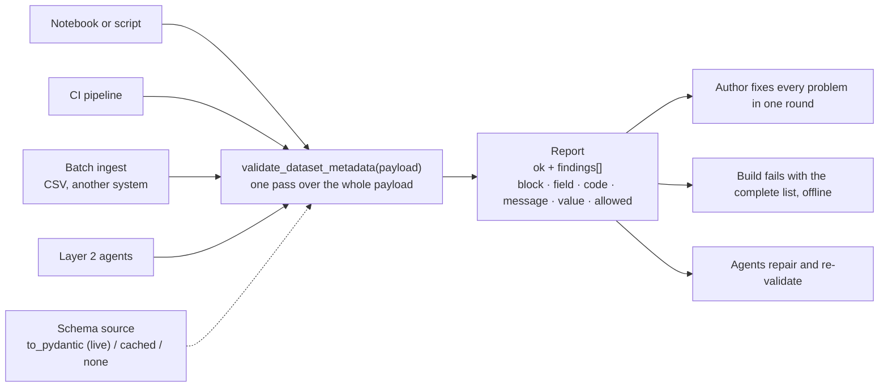
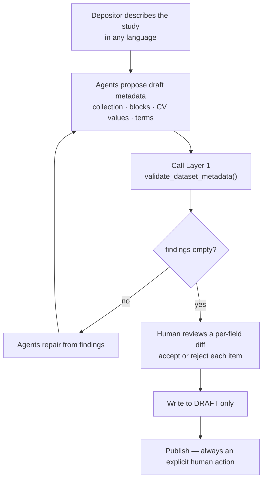

# Human-in-the-Loop Agentic Deposit Assistance for Dataverse

Public design notes for a two-layer approach to metadata correctness when depositing into
Dataverse.

**Layer 1** is a deterministic metadata validation API, proposed for pyDataverse. It
contains no AI and is useful on its own.
**Layer 2** is a guided deposit assistant implemented as a Dataverse External Tool, which
calls Layer 1 as its correctness check.

The layers are designed to fit together and are separable. Layer 1's callers include CI,
notebooks, and batch ingest independently of Layer 2, and nothing in Layer 1 depends on
Layer 2 existing.

## Status

| | Where | State |
|---|---|---|
| **Layer 1** — deterministic validation | [gdcc/pyDataverse#254](https://github.com/gdcc/pyDataverse/issues/254) | Proposed, under discussion |
| **Layer 2** — guided deposit assistant | This repository | Design sketch; not implemented |

Full design document: [`dataverse_agentic_deposit_proposal.md`](./dataverse_agentic_deposit_proposal.md)

## Design constraint

> Automation acts freely on drafts. On published versions it proposes; a human decides.

Published Dataverse versions are permanent and citable. Drafts are private and mutable, so
acting on them carries no preservation risk. Publication is never automated.

## Layer 1 — deterministic metadata validation

Takes assembled metadata, checks it in one pass against the schema the target installation
advertises, and returns every problem at once as structured findings. It does not raise.

Three of the four callers have no relationship to Layer 2.

Properties:

- **Whole payload, one pass.** Throwing at assignment returns one problem per run.
  Metadata assembled from a spreadsheet, a notebook, or another system often has several
  invalid fields at once.
- **Non-throwing, with a stable output type.** `Finding(block, field, code, message, value,
  allowed)` rather than an exception, so tooling can consume results without depending on
  the internal structure of a `ValidationError`.
- **Usable without a live instance.** Validation against a cached or serialized schema
  covers CI. Structural and Unicode checks run with no schema at all.
- **No AI dependency.**

### Motivating issues

Open pyDataverse issues in which a metadata problem surfaces as a library error rather than
as a field-level result:

- [#241](https://github.com/gdcc/pyDataverse/issues/241) — `"identifier_scheme": "ORCID"`
  produced `TypeError: issubclass() arg 1 must be a class` from
  `MetadataBlockBase._process_field_value`. Fixed in
  [#249](https://github.com/gdcc/pyDataverse/pull/249).
- [#164](https://github.com/gdcc/pyDataverse/issues/164) — API fails to handle the
  `astrophysics` and `biomedical` metadata blocks.
- [#161](https://github.com/gdcc/pyDataverse/issues/161) — JSON validator fails when a
  license is included.
- [#153](https://github.com/gdcc/pyDataverse/issues/153) — an installation making
  `kindOfData` controlled is not handled by the client.

### Non-Latin metadata

Dataverse installations hold multilingual metadata. Round-trip fidelity for the following
does not appear to be covered by tests, and each is a possible source of silent corruption
in a preservation system:

- Unicode normalisation (NFC vs NFD)
- non-ASCII values in controlled-vocabulary fields
- non-Latin author names and affiliations surviving serialise → POST → retrieve unchanged

Coverage for these is part of the Layer 1 scope regardless of Layer 2.

## Layer 2 — guided deposit assistant

A Dataverse External Tool (`Configure` type, dataset scope). Agents propose; Layer 1
determines validity; the human decides.

Properties:

- The deterministic validator, not a model, determines whether a value is valid.
- Accept and reject operate per item rather than on the whole set.
- Every action is recorded to a provenance log attached to the draft.
- Local and self-hosted models are a requirement. Research metadata is frequently sensitive
  before publication, so a design that assumes an external API call is unusable for part of
  the community.

See the [design document](./dataverse_agentic_deposit_proposal.md) for the agent
decomposition, interaction model, and failure modes.

## Sequence

1. Layer 1 validation module in pyDataverse, beginning with the `citation` block and
   non-Latin round-trip test coverage. No model involved.
2. Reference External Tool performing one function: draft-stage validation with a
   reviewable diff. Single agent, no orchestration.
3. Cross-stage consistency checks across related datasets.
4. Full orchestration and multilingual intake.

Each step is independently useful. Step 1 does not depend on step 4 being accepted.

## Scope of this repository

Design notes and work tracking. Layer 1 is tracked upstream in
[gdcc/pyDataverse](https://github.com/gdcc/pyDataverse); this repository does not fork or
vendor it.
