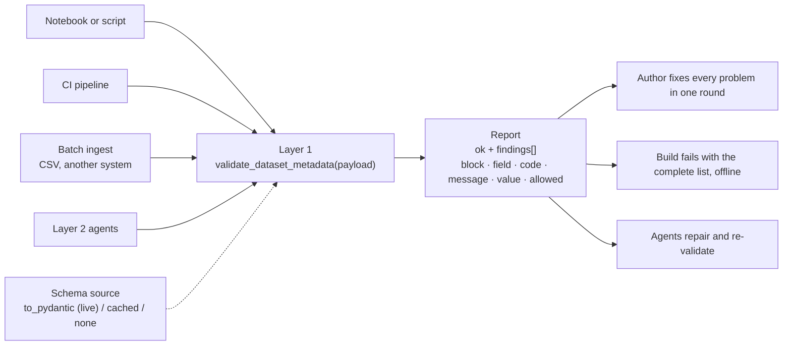
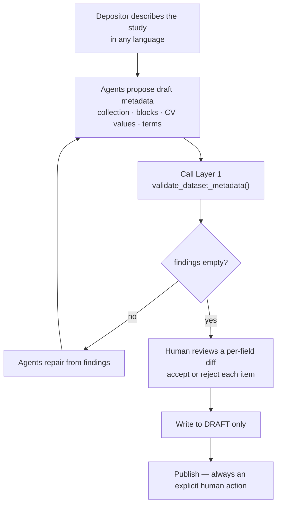

# Human-in-the-Loop Agentic Deposit Assistance for Dataverse

*A design proposal for discussion — Dataverse community*

---

## Summary

Two components. The first is a deterministic validation layer in pyDataverse that checks dataset metadata before it is sent to an instance, reporting every problem in one pass as field-level findings rather than raising on the first one. The second is a Dataverse External Tool built on that layer: a depositor describes their study in their own language, agents propose a complete draft — collection, metadata blocks, controlled-vocabulary values, terms — and the depositor accepts or rejects each proposed field individually.

The design question is how to make a correct deposit the default outcome without allowing automation to modify the permanent record.

---

## 1. Problem

Depositing research data into Dataverse requires a sequence of decisions that are not obvious on first encounter, and several of them are difficult or impossible to undo:

| Decision | Difficulty | Reversible? |
|---|---|---|
| Which collection to deposit into | Institutional, journal, and project collections carry different policies | Hard |
| Which metadata blocks beyond `citation` | Domain blocks (astrophysics, biomedical, geospatial, social science) are unfamiliar to most depositors | Yes (draft) |
| Controlled-vocabulary values | Free-text intent must map to a fixed allowed list; failures surface as tracebacks | Yes (draft) |
| Terms, licence, restricted access, embargo | Legal and IRB constraints, often institution-specific | Partly |
| DOI reserve vs. register | Timing interacts with publication | Hard |
| When to publish | Published versions are permanent and citable | Effectively no |

For a multi-stage study — common in longitudinal, clinical, and instrument-driven research — metadata must also stay consistent across related datasets produced at different stages. No current mechanism checks this.

The cost of a mistake in this workflow is asymmetric: cheap to make, expensive to correct, and in the case of publication, permanent.

## 2. Scope

**In scope:** a system that helps a depositor arrive at a correct draft by proposing changes that a human reviews and accepts.

**Out of scope:** acting on published data, merging code, or replacing curatorial judgement.

One constraint governs the rest of the design:

> Automation acts freely on drafts. On published versions it proposes; a human decides.

Drafts are private and mutable, so acting on them carries no preservation risk. Published versions are permanent and citable.

## 3. Layering

The proposal has two layers. They are separable, and the lower one is useful on its own.

Three of the four callers have no relationship to Layer 2.

Layer 1 is proposed separately as a pyDataverse feature request (gdcc/pyDataverse#254). It has value independent of Layer 2, and it establishes the correctness authority for Layer 2: the deterministic validator, not the model, determines whether a value is valid.

Layer 2 is a Dataverse External Tool (`Configure` type, dataset scope), alongside existing tools such as Ask the Data and TurboCurator. It requires no changes to Dataverse core.

## 4. Rationale for a multi-agent decomposition

Each boundary in the decomposition corresponds to a property that a single model call does not provide.

**Context separation.** Installation configuration, domain metadata schemas, sibling datasets from earlier study stages, and institutional policy are large bodies of context with little overlap. Scoping each agent to its own corpus keeps context size bounded and relevant.

**Privilege separation.** The policy agent reads configuration. The metadata agent writes to a draft. The provenance agent writes to a log only. This partition is enforceable and auditable, which is relevant in a repository holding pre-publication and restricted research data.

**Separation of proposal from verification.** The component that proposes a metadata value is not the component that judges it. Verification is performed independently against the Layer 1 validator.

**Failure isolation.** A failure in the domain-block agent removes one class of suggestion rather than ending the session.

## 5. Agents

| Agent | Reads | Produces | Acts on drafts |
|---|---|---|---|
| **Intake** | Depositor's description of the study, in their own language | Structured deposit intent | No |
| **Collection & policy** | Installation config, collection policies, IRB / embargo / licence constraints | Recommended collection and applicable terms | No |
| **Metadata block** | Deposit intent, metadata block schemas from the target installation | Proposed field values, including controlled-vocabulary mapping | Proposes |
| **Validation** | Proposed values, Layer 1 validator output | Findings, repair suggestions, re-check | Proposes |
| **Cross-stage consistency** | Sibling datasets from earlier stages | Drift report: authors, funding, keywords, CV choices, linkage | Proposes |
| **Provenance** | Every agent action and human decision | Audit record attached to the draft | Writes log only |

The provenance agent is a required component. Institutional adoption depends on a record of what changed, which component proposed it, who accepted it, and when.

### Multilingual intake

A substantial share of Dataverse installations serve non-English-speaking researchers. Supporting a depositor who describes their study in Chinese, Japanese, or Korean, and returning correct English controlled-vocabulary mappings, addresses a case where metadata is otherwise commonly left incomplete.

This also raises a correctness question that exists today, independent of any agent. Non-Latin metadata values pass through the same serialisation path as all other values, and the following do not appear to be covered by tests:

- Unicode normalisation (NFC vs NFD) round-tripping
- non-ASCII values in controlled-vocabulary fields
- non-Latin author names and affiliations surviving serialise → POST → retrieve unchanged

In a preservation system these are possible sources of silent corruption. Coverage for them is proposed as part of Layer 1.

## 6. Interaction model

The unit of interaction is a reviewable change set.

1. The depositor describes the deposit, in any supported language.
2. Agents produce a proposed change set against the draft.
3. The depositor is shown a per-field diff: current value, proposed value, originating agent, rationale, and confidence.
4. Accept and reject operate per item rather than on the whole set.
5. Low-confidence items require an explicit decision and are excluded from bulk accept.
6. Every action is written to the provenance record.
7. Publication is never automated; it remains an explicit human action.

Items 4 and 5 address the primary failure mode of assisted-editing systems: a plausible but incorrect suggestion accepted without review.

## 7. Failure modes

| Risk | Mitigation |
|---|---|
| Model produces a plausible but invalid controlled-vocabulary value | The deterministic validator determines validity; model output is a candidate |
| Cross-stage agent anchors on an earlier deposit that was itself incorrect, propagating drift | Consistency findings are reported as differences and never auto-applied; earlier values are not treated as ground truth |
| Suggestions accepted without review | Per-item accept, confidence surfacing, explicit decisions required on low confidence |
| Non-Latin text corrupted without detection | Layer 1 Unicode round-trip tests convert this into a test failure |
| Institutions cannot transmit pre-publication research metadata to a third-party API | Local and self-hosted model support is a requirement; the architecture is model-agnostic and runs fully on-premises |
| Cost and latency for self-hosted installations | Agents are individually optional; Layer 1 operates with no model |
| Scope creep into Dataverse core | Layer 2 is an External Tool, requires no core changes, and can be removed without residue |

On the self-hosting requirement: research metadata is frequently sensitive before publication, including embargoed findings, human-subjects work, and unpublished results. A design that assumes an external API call is unusable for a significant part of the community.

## 8. Proposed sequence

1. **Layer 1 validation module** in pyDataverse, beginning with the `citation` block and non-Latin round-trip test coverage. No model involved.
2. **Reference External Tool** performing one function: draft-stage metadata validation with a reviewable diff. Single agent, no orchestration.
3. **Cross-stage consistency**, after (1) and (2) are in use and the diff model has been exercised by real depositors.
4. **Full orchestration and multilingual intake**, after the review interaction has been validated against real deposits.

Each step is independently useful. Step 1 does not depend on step 4 being accepted.

## 9. Questions for the community

1. Is the draft / published boundary the correct constraint, or too permissive even for drafts?
2. Is a `Configure`-type External Tool the right integration point, or is there a better one?
3. What would an institution need to see — audit format, self-hosting story, evaluation evidence — before enabling this in production?
4. Is there existing or in-flight community work this should align with rather than duplicate?

I'm happy to do the work, starting with Layer 1, and would like input on direction before building further.
